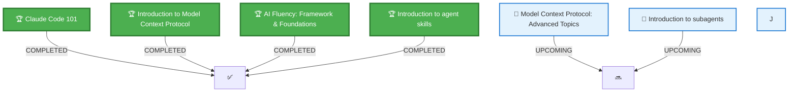

# 🎓 CLAUDE CODE

])

 

### **Maîtrisez Claude grâce à la plateforme d'apprentissage officielle d'Anthropic**

*Développer mon expertise dans l'usage de cet IA*

---

## 🏆 **Certifications obtenues**

### 🌟 **Claude Code 101**

**Certificate ID:** `x4oqd48w2ohv`  
**Vérification:** [Voir le certificat](https://verify.skilljar.com/c/x4oqd48w2ohv)

---

### 💻 **Introduction to Model Context Protocol**
>

**Certificate ID:** `a7cw6aow9zok`  
**Vérification:** [Voir le certificat](https://verify.skilljar.com/c/a7cw6aow9zok)

---

### 🌀 **AI Fluency: Framework & Foundations**

**Certificate ID:** `iwx6rx7fve4r`  
**Vérification:** [Voir le certificat](https://verify.skilljar.com/c/iwx6rx7fve4r)

---

### 👷 **Introduction to agent skills**

**Certificate ID:** `zni5xi6cmnat`  
**Vérification:** [Voir le certificat](https://verify.skilljar.com/c/zni5xi6cmnat)

<!-- Dupliquez un bloc ci-dessus pour chaque certification supplémentaire -->

---

## 📚 **Parcours d'apprentissage en cours**

---
## 📊 **Vue d'ensemble de la progression**

| Statut | Cours | Achèvement prévu |
|:------:|:-------|:-------------------|
| ✅ | **Claude Code 101** | Terminé |
| ✅ | **Introduction to Model Context Protocol** | Terminé |
| ✅ | **AI Fluency: Framework & Foundations** | Terminé |
| ✅ | **Introduction to agent skills** | Terminé |
| 📅 | **Model Context Protocol: Advanced Topics** | À venir |
| 📅 | **Introduction to subagents** | À venir |

---

