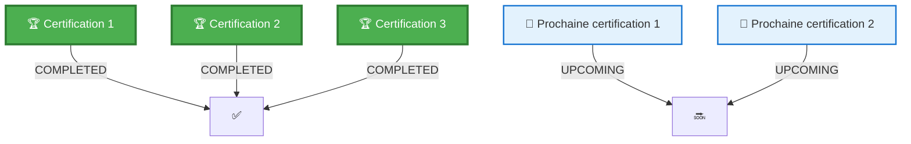
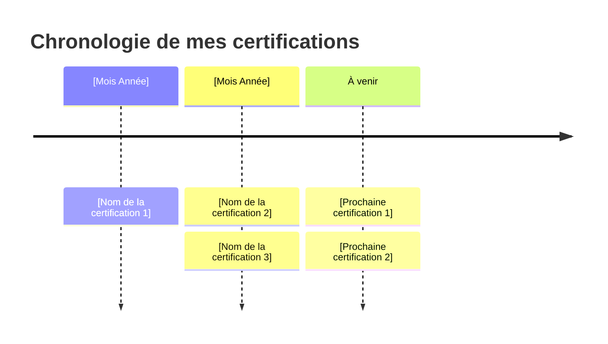

<div align="center">

# 🎓 CLAUDE CODE

[](https://www.anthropic.com/learn)
[](https://github.com/Charlene7508/[[Anthropic_Certificate](https://github.com/Charlene7508/Anthropic_Certificates.git)])
[](https://anthropic.skilljar.com/)

<br/>


### **Maîtrisez Claude grâce à la plateforme d'apprentissage officielle d'Anthropic**

*Développer mon expertise dans l'usage de cet IA*

</div>

---

## 🏆 **Certifications obtenues**

<div align="center">

### 🌟 **Claude Code 101**


**Certificate ID:** `x4oqd48w2ohv`  
**Vérification:** [Voir le certificat](https://verify.skilljar.com/c/x4oqd48w2ohv)

---

### 💻 **[NOM DE LA CERTIFICATION 2]**


**Certificate ID:** `[VOTRE_ID_DE_CERTIFICAT_2]`  
**Délivré le:** [JJ Mois AAAA]  
**Vérification:** [Voir le certificat]([LIEN_DE_VERIFICATION])

---

### 🚀 **[NOM DE LA CERTIFICATION 3]**


**Certificate ID:** `[VOTRE_ID_DE_CERTIFICAT_3]`  
**Délivré le:** [JJ Mois AAAA]  
**Vérification:** [Voir le certificat]([LIEN_DE_VERIFICATION])

<!-- Dupliquez un bloc ci-dessus pour chaque certification supplémentaire -->

</div>

---

## 📚 **Parcours d'apprentissage en cours**

<div align="center">



</div>

### 📊 **Vue d'ensemble de la progression**

| Statut | Cours | Achèvement prévu |
|:------:|:-------|:-------------------|
| ✅ | **[Certification 1]** | Terminé |
| ✅ | **[Certification 2]** | Terminé |
| ✅ | **[Certification 3]** | Terminé |
| 📅 | **[Prochaine certification 1]** | À venir |
| 📅 | **[Prochaine certification 2]** | À venir |

---

## 💡 **Compétences clés développées**

<div align="center">

<table>
<tr>
<td align="center" width="25%">

### 🧠 **[Domaine de compétence 1]**
```python
# Point clé 1
# Point clé 2
# Point clé 3
# Point clé 4
```

</td>
<td align="center" width="25%">

### 🔧 **[Domaine de compétence 2]**
```javascript
// Point clé 1
// Point clé 2
// Point clé 3
// Point clé 4
```

</td>
<td align="center" width="25%">

### 💻 **[Domaine de compétence 3]**
```bash
# Point clé 1
# Point clé 2
# Point clé 3
# Point clé 4
```

</td>
<td align="center" width="25%">

### 🛡️ **[Domaine de compétence 4]**
```yaml
domaine:
  - Point clé 1
  - Point clé 2
  - Point clé 3
  - Point clé 4
```

</td>
</tr>
</table>

</div>

---

## 🎯 **Matrice de compétences**

<div align="center">

| Domaine de compétence | Niveau | Application |
|:-----------|:-----------:|:------------|
| **[Compétence 1]** | ██████████ 100% | [Description de l'application] |
| **[Compétence 2]** | ██████████ 100% | [Description de l'application] |
| **[Compétence 3]** | ██████████ 100% | [Description de l'application] |
| **[Compétence 4]** | ░░░░░░░░░░ 0% | [Cours à venir / en cours] |
| **[Compétence 5]** | ░░░░░░░░░░ 0% | [Cours à venir / en cours] |

</div>

---

## 🚀 **Applications concrètes**

<div align="center">

### **Projets réalisés grâce à ces certifications**

| Projet | Technologies | Impact |
|:--------|:------------|:-------|
| 🤖 **[Nom du projet 1]** | [Technologies utilisées] | [Résultat mesurable] |
| 📝 **[Nom du projet 2]** | [Technologies utilisées] | [Résultat mesurable] |
| 🔍 **[Nom du projet 3]** | [Technologies utilisées] | [Résultat mesurable] |
| 🛡️ **[Nom du projet 4]** | [Technologies utilisées] | [Résultat mesurable] |

</div>

---

## 📈 **Chronologie du parcours d'apprentissage**



---

## 🎓 **À propos de la plateforme**

[**Nom de la plateforme**]([LIEN_DE_LA_PLATEFORME]) est la plateforme sur laquelle vous avez suivi vos formations. Elle propose :

- 📚 **Curriculum complet** - [Description]
- 🎯 **Apprentissage pratique** - [Description]
- 🏆 **Certification officielle** - [Description]
- 🔄 **Mises à jour continues** - [Description]
- 👥 **Accès communautaire** - [Description]

---

## 🌟 **Pourquoi ces certifications comptent**

<div align="center">

| Avantage | Description |
|:--------|:------------|
| **[Avantage 1]** | [Description] |
| **[Avantage 2]** | [Description] |
| **[Avantage 3]** | [Description] |
| **[Avantage 4]** | [Description] |
| **[Avantage 5]** | [Description] |

</div>

---

## 📬 **Me contacter**

<div align="center">

### **[Votre phrase d'accroche pour le contact]**

[](https://github.com/[VOTRE_USERNAME])
[](mailto:[VOTRE_EMAIL])

### **Ouvert·e à :**
- 🤝 [Type de collaboration 1]
- 💡 [Type de collaboration 2]
- 📚 [Type de collaboration 3]
- 🚀 [Type de collaboration 4]

</div>

---

<div align="center">

### **[Votre devise ou engagement]**

```
"[Citation inspirante]"
- [Auteur de la citation]
```

**[Votre phrase de conclusion]**

<br/>

[](https://github.com/[VOTRE_USERNAME]/[VOTRE_REPO])
[](https://github.com/[VOTRE_USERNAME]/[VOTRE_REPO])
[](LICENSE)

<sub>Dernière mise à jour : [JJ Mois AAAA] | [Votre mention de fin]</sub>

</div>
